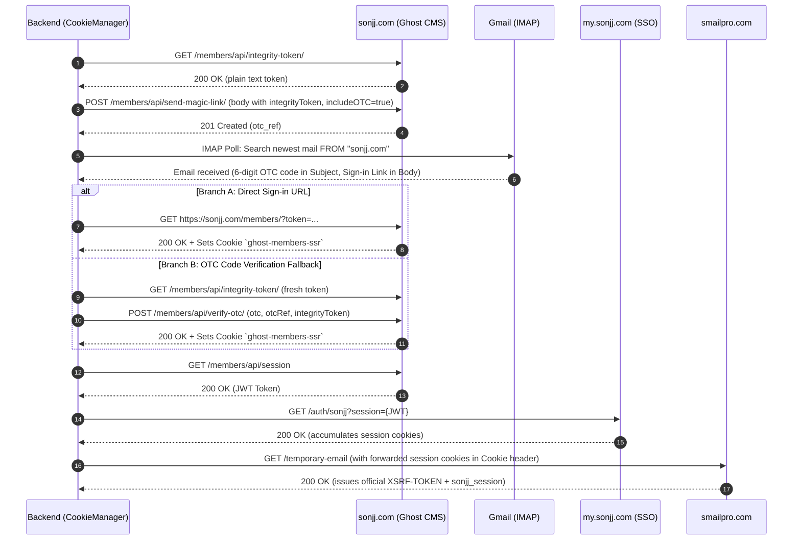

# Design Spec: Auto-Cookie Acquisition with Integrity Token and Dual Auth (Sign-in Link & OTC Fallback)

## 1. Executive Summary

This specification upgrades the automatic SmailPro/Sonjj cookie acquisition engine in `CookieManager` (`backend/app/integrations/cookie_manager.py`) to align with the latest Ghost CMS / Cloudflare authentication flow discovered from live traffic recordings (`smailpro.com.har`).

Key capabilities added:
- Explicit acquisition of Ghost `integrityToken` prior to invoking `/members/api/send-magic-link/`.
- Dual authentication fallback mechanism: Primary authentication via direct magic link URL (`https://sonjj.com/members/?token=...`) with automatic fallback to 6-digit OTC code verification (`https://sonjj.com/members/api/verify-otc/`).
- Forwarding of accumulated session cookies to `smailpro.com` across domains and resilient extraction of `XSRF-TOKEN` and `sonjj_session`.

---

## 2. Architecture and Sequence Flow



---

## 3. Staged Flow Components

### Stage 1: `_get_integrity_token(client)`
- **HTTP Call:** `GET https://sonjj.com/members/api/integrity-token/`
- **Headers:** `User-Agent`, `Origin: https://sonjj.com`, `Referer: https://sonjj.com/redirect-auth/`
- **Output:** Returns non-empty plain-text `integrity_token` string.
- **Error Handling:** On HTTP >= 400 or network error, raises `CookieRefreshError(CookieRefreshStage.MAGIC_LINK_REQUEST, CookieRefreshReason.UPSTREAM_REJECTED)`.

### Stage 2: `_request_magic_link(client, integrity_token)`
- **HTTP Call:** `POST https://sonjj.com/members/api/send-magic-link/`
- **Payload:**
  ```json
  {
    "email": "<gmail_email>",
    "emailType": "signin",
    "requestSrc": "portal",
    "integrityToken": "<integrity_token>",
    "autoRedirect": true,
    "includeOTC": true,
    "urlHistory": [
      {
        "path": "/redirect-auth/",
        "time": "<current_timestamp_ms>",
        "referrerUrl": "https://my.sonjj.com/"
      }
    ]
  }
  ```
- **Output:** Parses response JSON and returns `otc_ref: Optional[str]`.
- **Error Handling:** Raises `CookieRefreshError(CookieRefreshStage.MAGIC_LINK_REQUEST, CookieRefreshReason.UPSTREAM_REJECTED)` if status is not 200/201.

### Stage 3: `_read_gmail_auth_async(max_wait, poll_interval)`
- **Execution:** Runs blocking IMAP polling via `asyncio.to_thread`.
- **IMAP Details:**
  - `IMAP4_SSL("imap.gmail.com")` with `select("INBOX", readonly=True)`.
  - `uid("search", None, 'FROM "sonjj.com"')`.
  - Inspects latest 10 messages created within `_flow_started_at - 2min`.
- **Extraction:**
  - `signin_url`: Regex matches `r'(https://sonjj\.com/members/\?token=[^\s\)"\'>\]]+)'`.
  - `otc_code`: Regex matches 6-digit standalone code `r'\b(\d{6})\b'` from Subject or Body.
- **Output:** Returns `Tuple[Optional[str], Optional[str]]` (`(signin_url, otc_code)`).
- **Error Handling:** If neither `signin_url` nor `otc_code` is found within `max_wait`, raises `CookieRefreshError(CookieRefreshStage.IMAP_POLL, CookieRefreshReason.MESSAGE_NOT_FOUND)`.

### Stage 4: Authentication via Sign-in Link or OTC Code
- **Branch A (Sign-in Link):**
  If `signin_url` is present:
  `GET signin_url` with `follow_redirects=True`. Verifies status 200/302 and that `ghost-members-ssr` cookie is stored in `client.cookies`.
- **Branch B (OTC Code Fallback):**
  If `signin_url` is missing or fails:
  If `otc_code` and `otc_ref` are available:
  1. Calls `_get_integrity_token(client)` to obtain a fresh integrity token.
  2. `POST https://sonjj.com/members/api/verify-otc/` with:
     ```json
     {
       "otc": "<otc_code>",
       "otcRef": "<otc_ref>",
       "integrityToken": "<fresh_integrity_token>"
     }
     ```
  3. Verifies status 200 and that session cookies are set.

### Stage 5: Session JWT & SSO
- **JWT Fetch:** `GET https://sonjj.com/members/api/session`.
  Extracts `jwt` string from JSON response `{"jwt": "..."}` or raw text.
- **SSO Synchronization:** `GET https://my.sonjj.com/auth/sonjj?session={jwt}`.
  Accumulates authentication cookies for `my.sonjj.com`.

### Stage 6: SmailPro Cookie Pair Extraction
- **Forwarding:** Builds `Cookie` header from all accumulated cookies in `client.cookies.jar`:
  `Cookie: ghost-members-ssr=...; XSRF-TOKEN=...; sonjj_session=...`
- **SmailPro Request:** `GET https://smailpro.com/temporary-email` with explicit `Cookie` header.
- **Extraction:** Extracts and unquotes:
  - `XSRF-TOKEN` (unquoted URL-decoded string)
  - `sonjj_session`
  With regex fallback directly from response `Set-Cookie` headers.

---

## 4. Security, Concurrency & Invariants

1. **Secret Hygiene:** Tokens, passwords, magic link URLs, OTPs, and cookies are never emitted to structured logs or telemetry events.
2. **Safe Telemetry Boundary:** Only safe stages (`magic_link_request`, `imap_poll`, `signin`, `session`, `sso`, `smailpro_cookie`) and reasons (`upstream_rejected`, `poll_timeout`, `cookie_pair_missing`, etc.) are recorded.
3. **Single-Flight Concurrency:** Protected by `asyncio.Lock()`. Callers sharing the same generation reuse freshly minted cookies.
4. **Memory-Only Persistence:** Default behavior keeps cookies strictly in-memory (`cookie_persistence=none`).

---

## 5. Verification & Testing Strategy

- **Automated Mock Tests (`pytest` + `respx`):**
  - Full flow test with integrity token and magic link signin URL.
  - Fallback flow test with integrity token and OTC verification.
  - Failure scenario tests: Integrity token rejected, send-magic-link rejected, OTC code invalid, missing cookies.
- **Contract & Regression Tests:**
  - Adapter contract tests in `test_adapters_contract.py`.
  - Cookie lifecycle and concurrency tests in `test_auto_cookie.py`.
